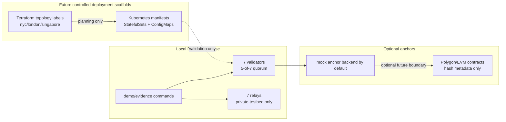

# pq-fabric architecture

`pq-fabric` is organized as one platform with separable workstreams.

## 1. Consensus and identity layer

The first runnable layer is a seven-validator local network. Each validator has deterministic local identity metadata, signs votes, and commits a block when a quorum certificate contains at least five unique valid validator votes for the same height, round, stage, and block hash.

Current consensus flow:

1. The scheduled proposer for a height/round creates a block with ordered transactions and a deterministic state digest.
2. The proposer signs the block hash and sends a proposal.
3. Peers verify height, round, previous hash, proposer schedule, proposal signature, local lock state, and state digest before prevoting.
4. The proposer forms a prevote quorum certificate from five or more unique prevotes.
5. Validators precommit only against a matching prevote certificate.
6. The proposer forms a precommit quorum certificate and commits locally.
7. Peers verify the certificate before applying the commit and replaying the deterministic state transition.

Proposer selection is deterministic from height, round, and the validator set ordering. Height 1 round 0 maps to `validator-1`, height 1 round 1 maps to `validator-2`, and height 2 round 0 maps to `validator-2`. If the scheduled proposer is unavailable, a caller advances rounds until a live proposer can produce a valid commit or the configured max round limit is reached.

The lock model is conservative. A validator records the height, round, block hash, and source quorum metadata for its latest precommit/commit and refuses conflicting votes at the same height. The implementation rejects duplicate votes, conflicting same-stage votes, unknown validators, wrong block hashes, wrong stages, malformed proposals, stale heights, stale rounds, and unscheduled proposers.

This is intentionally a first-principles prototype, not a production BFT implementation.

## 2. Self-healing evidence harness

Phase 5 adds a local, deterministic evidence layer around the validator prototype. It does not change consensus quorum rules or productionize orchestration.

The health model records validator ID, region, current height, current round, latest committed hash, latest state digest, heartbeat tick, and status. Supported statuses are `healthy`, `degraded`, `suspected_failed`, `failed`, `recovering`, and `recovered`.

The heartbeat detector is intentionally simple and deterministic for tests. The in-process harness emits heartbeat records with logical ticks, applies configurable missed-heartbeat thresholds, detects lagging validators, detects inconsistent height/hash/digest reports, and emits structured evidence records instead of relying on console text.

The remediation controller in `consensus/fault` is a local testbed component. It can stop simulated validators, mark them for remediation, restart them with their isolated durable data directories, request catch-up from committed peers, validate quorum certificates while replaying missing blocks, and verify final convergence to the expected height/hash/state digest.

The fault demo also records application-level message preservation metrics. In this prototype, that means accepted transaction IDs are either committed once or deduplicated on replay; it does not mean transport-level zero packet loss.

## 3. Byzantine Bundle Protocol scaffolding

The bundle layer is a local deterministic prototype inspired by CCSDS-style virtual channels and Bundle Protocol custody transfer. It now includes:

- canonical bundle envelopes with deterministic digesting,
- virtual channels for `conversation`, `working_memory`, `execution`, and `retrieval`,
- priority-weighted scheduling with context budget enforcement,
- no-op and gzip compression hooks,
- deterministic eviction policies,
- store-and-forward retransmission keyed by transaction ID and sequence number,
- deterministic state reconciliation after interruption,
- custody transfer represented as validator quorum confirmation,
- local mock OpenAI-compatible request/response structs.

Custody confirmation reuses the existing validator vote and quorum-certificate primitives as local evidence: a custody event is confirmed only when at least five unique valid validator votes sign the same custody event digest. Duplicate votes, unknown validators, invalid signatures, and mismatched bundle digests do not count.

The AI context manager maps model-shaped context into four channels. Execution has the highest default priority, retrieval is lower priority and can be evicted before higher-priority context under budget pressure, and working memory can be snapshotted through the existing durable storage snapshot interface.

The mock AI provider is interface-shape only. It produces deterministic local responses for tests and demos and never calls OpenAI, Anthropic, Gemini, or any external model API.

This bundle layer is not production AI infrastructure, production data sovereignty, production transport reliability, or production BFT safety.

## 4. Validator storage layer

Validators default to memory storage for fast tests and the local demo. The validator daemon can also run with durable file-backed storage by setting `--storage durable --data-dir ./data/validator-1` or with SQLite by setting `--storage sqlite --database-url ./data/validator-1/validator.db`.

Durable storage writes JSON/JSONL records under one validator-specific data directory. It persists the committed block log, latest committed height/hash/state digest, quorum certificate JSON for committed blocks, validator identity reference metadata, lock metadata, idempotency/replay ledger entries, and optional checkpoint records. Commit records and idempotency entries are flushed before the corresponding operation reports success.

SQLite storage persists the same logical records through transactions and indexes evidence by evidence ID, event hash, receipt ID, idempotency key, submitter, commit height, and quorum-certificate hash. Production mode requires SQLite; the JSON/JSONL backend remains for local demos.

On startup, validators load committed records, verify hash-chain continuity and quorum certificates against the current validator identity set, and fail safely on corrupt state or mismatched identity metadata.

This remains regulated-pilot hardening, not broad production readiness, and it does not change the existing 5-of-7 quorum rules.

## 5. Private-testbed routing layer

The routing layer is a controlled local onion-routing testbed. It initializes a seven-relay topology named `relay-1` through `relay-7`, maps relays to the same region labels used elsewhere, and builds one explicit three-hop path such as `relay-1` in NYC, `relay-4` in London, and `relay-7` in Singapore.

Circuit construction is telescoping at the protocol level:

1. The client establishes a KEM-derived layer key with the entry relay.
2. The client extends through the entry relay to the middle relay.
3. The client extends through entry and middle to the exit relay.
4. Each relay stores only local predecessor, successor, role, circuit ID, and local layer key state.

Layered cells use per-hop keys derived through the crypto suite abstraction. The client wraps payloads in exit, middle, then entry layers. Entry and middle relays remove only their own layer and forward the remaining encrypted bytes. The exit relay removes the final layer, validates the local-only exit policy, and forwards to an in-process local test service. Response wrapping is modeled with the same hop keys on the reverse path for the prototype.

The restricted SOCKS5 proxy supports local CONNECT requests into the testbed and rejects unsupported commands or destinations outside the allowlist. Stream multiplexing assigns unique stream IDs per circuit and rejects duplicate or unknown stream IDs.

This routing layer does not implement public relay discovery, public exits, production anonymity, production privacy, censorship resistance, traffic obfuscation, or production post-quantum security.

## 6. Polygon-compatible contract anchors

The anchor layer has two boundaries:

- `contracts/polygon` is a self-contained Foundry project with Polygon/EVM-compatible contracts.
- `core/anchors` is the Go anchor-client interface used by tests and demos, with a deterministic mock backend for local verification.

The contracts anchor hashes, metadata, and references for:

- validator identity metadata and key fingerprints,
- credential hashes linked to subject and issuer validator identities,
- governance proposal hashes and lifecycle state,
- quorum-certificate hashes with height, round, block/event hash, quorum threshold, and signer count.

The duplicate policy is explicit: duplicate artifact anchors revert. Identity registration also reverts on duplicate validator ID; identity updates are separate authorized operations.

Actual post-quantum signature verification, validator identity/key verification, quorum-certificate verification, and consensus safety remain off-chain in validators for this prototype. The on-chain records are evidence anchors only, not EVM verification of ML-DSA signatures or quorum correctness.

## 7. Deployment path scaffold

Phase 9 adds a deployment path without turning the repo into a production network. The deployment layer is split into safe local execution, future Kubernetes scaffolding, future Terraform planning, and operational runbooks.

Local Docker Compose builds one reusable `pq-fabric:local` image and models:

- seven validator services with isolated durable data directories,
- seven private-testbed relay services under the `relays` profile,
- localhost-bound validator ports,
- an internal Compose network,
- one-shot demo/evidence service profiles.

Kubernetes manifests under `deployments/k8s` model validator and relay StatefulSets, ConfigMap-based non-secret configuration, persistent volume claim templates for validator state, private services, and a local NetworkPolicy. They are meant for client-side manifest validation and future controlled deployment planning, not for production cluster use.

Terraform files under `deployments/terraform` model the intended three-region shape with labels for `nyc`, `london`, and `singapore`. The current scaffold intentionally has no live cloud provider resources, remote backend, or credentials. `terraform validate` can run locally, but `terraform apply` is out of scope for Phase 9.

Deployment config templates live under `config/local` and `config/examples`. Real `.env`, `.tfvars`, kubeconfig, wallet, key, generated state, and deployment output files are ignored. Future real deployments must use proper secret management.

This deployment path is not production hardening, production BFT safety, production anonymity, production post-quantum security, FIPS certification, ACVTS validation, audited smart-contract security, or production deployment readiness.

## Crypto adapter status

The checked-in implementation has two selectable crypto suites:

- `dev` is the default suite. It uses Ed25519 and X25519 development adapters occupying the ML-DSA-87 and ML-KEM-768 protocol slots for deterministic local tests. These adapters are not post-quantum secure.
- `pq` uses implementation-backed ML-DSA-87 signatures and ML-KEM-768 key establishment for engineering validation.

The protocol code is intentionally isolated behind crypto interfaces so consensus and routing callers do not hard-code concrete crypto implementations. Select a suite with `PQ_FABRIC_CRYPTO_SUITE=dev` or `PQ_FABRIC_CRYPTO_SUITE=pq`; unset defaults to `dev`.

Validator identity metadata records validator ID, region, signature algorithm, signature public key bytes, KEM algorithm, KEM public key bytes, and a deterministic key ID/fingerprint helper for test assertions.

The `pq` suite compiling and passing tests is engineering evidence only. It is not FIPS 140-3 certification, ACVTS validation, or a production security claim.
