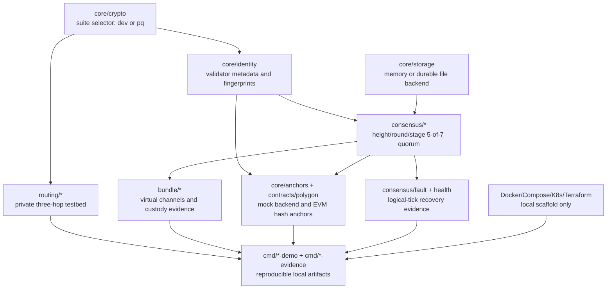

# Final Architecture Summary

`pq-fabric` is a local prototype organized around shared identity, crypto, canonical message, storage, consensus, routing, bundle, anchor, and evidence boundaries.

## Crypto Abstraction

`core/crypto` defines the signature and KEM interfaces. `core/crypto/suite` selects `dev` by default or `pq` when explicitly configured. Development crypto is deterministic and not post-quantum secure. The `pq` suite is implementation-backed engineering validation, not certification.

## Validator Identity

Validator identities include validator ID, region, signature algorithm/public key, KEM algorithm/public key, and deterministic fingerprints. Anchor records are derived from this local identity metadata.

## Consensus And Quorum

Consensus uses explicit height, round, proposal, prevote/precommit stages, quorum certificates, lock state, and deterministic state digests. A commit requires at least five unique valid validator votes out of seven for the same height/round/stage/block hash.

## Durable State

Validators can use memory storage, durable file-backed storage, or SQLite. Durable state persists committed block logs, latest state, quorum certificate JSON, lock metadata, identity references, idempotency ledger entries, and snapshots; SQLite adds transactional writes and indexed evidence lookup for the regulated-pilot path.

## Self-Healing Harness

The failure harness uses logical ticks, deterministic heartbeat records, local remediation, durable state reload, catch-up from peers, and structured evidence records. It is not production orchestration.

## Routing Testbed

Routing builds an explicit local seven-relay topology and a three-hop circuit. It uses per-hop KEM-derived keys, layered cells, restricted SOCKS5-style flows, stream multiplexing, and local-only exit policy. It is not a public anonymity network.

## Bundle And AI Context

The bundle layer models virtual channels for conversation, working memory, execution, and retrieval. It includes priority scheduling, canonical envelopes, custody confirmation through validator quorum evidence, retransmission, deduplication, reconciliation, and a local mock OpenAI-compatible provider.

## Anchor Boundary

`core/anchors` is the Go interface. `contracts/polygon` contains Polygon/EVM-compatible contracts that anchor hashes and metadata only. PQ signatures and quorum certificates are verified off-chain.

## Deployment Scaffold

Docker Compose runs a local topology. Kubernetes and Terraform files are validation/planning scaffolds. They do not deploy cloud resources or public networks.

## Evidence Pipeline

Focused evidence commands produce subsystem artifacts. `make e2e-evidence` produces an integrated summary that references the local harnesses and records tool availability, non-claims, and generated artifact paths.
